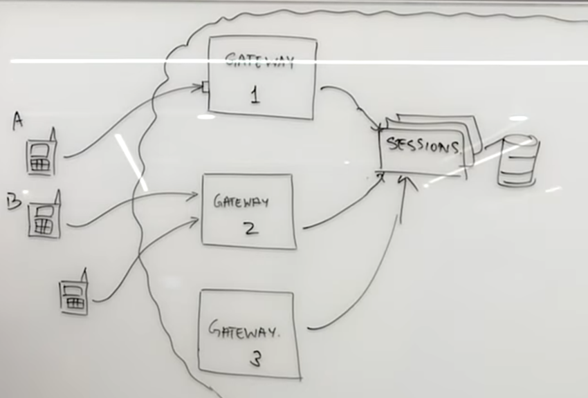

# Whatsapp System Design: Chat Messaging Systems
## Features required
Ask the interviewer whether these features are required:
1. One-to-one messaging
2. Group Messaging
3. Sent + Delivered + Read Receipt
4. Online / Last seen
5. Image Sharing: To be taken-up in Tinder Design
6. Chats are temporary / permanent: Official communications generally require permanent storage for Compliance reasons. On the other hand, Whatsapp is more temporary. If both you and your friend deletes the app, those messages are lost forever. Depending upon the requirement, the chat can be stored at Client side or server side.

They are probably going to say yes to first few features. So, use the order with which you are most comfortable.

Also ask about the scale at which the application is to be used, the user base etc.

## System Design
* The application is installed on your phone/laptop and you connect to the Server on Cloud. The place that we connect to is the ***Gateway***.
* We will have multiple "Boxes" at Server side and users con be connected to different Box depending upon the location, traffic etc. 
* This information about which user in connected to which Box can be stored at the Gateway itself. This is just a UserId to BoxId mapping. This, however, is not a good idea as the information is duplicated across all the Boxes.
* Instead of this coupled design, we can create a ***Sessions Microservice***. The Service can be scaled up and down on the basis of demand.

## Source
* https://www.youtube.com/watch?v=vvhC64hQZMk