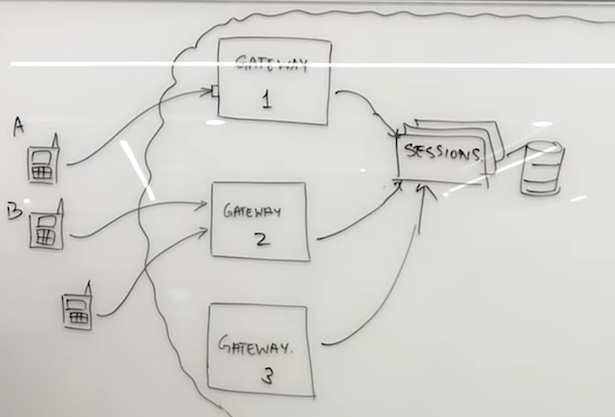
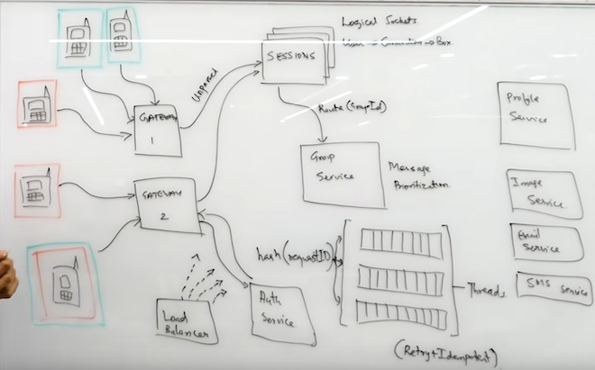

# Whatsapp System Design: Chat Messaging Systems

## Features required
Ask the interviewer whether these features are required:
1. One-to-one messaging
3. Sent + Delivered + Read Receipt
4. Online/Last seen
2. Group Messaging
5. Image Sharing: To be taken-up in Tinder Design
6. Chats are temporary / permanent: Official communications generally require permanent storage for Compliance reasons. On the other hand, Whatsapp is more temporary. If both you and your friend deletes the app, those messages are lost forever. Depending upon the requirement, the chat can be stored at Client side or server side.

They are probably going to say yes to first few features. So, use the order with which you are most comfortable.

Also ask about the scale at which the application is to be used, the user base etc.

## One-to-one messaging and Receipts
* The application is installed on your phone/laptop and you connect to the Server on Cloud. The place that we connect to is the ***Gateway***.
* We will have multiple "Boxes" at Server side and users con be connected to different Box depending upon the location, traffic etc. 
* This information about which user in connected to which Box can be stored at the Gateway itself. This is just a UserId to BoxId mapping. This, however, is not a good idea as the information is duplicated across all the Boxes.
* Instead of this coupled design, we can create a ***Sessions Microservice***. The Service can be scaled up and down on the basis of demand.

* The Sessions Microservice simply stores -- Who is connected to which box. This has allowed us to decouple Sessions information from the gateway.
  1. Let us say that User A wants to send message to user B. It calls `sendMessage(B)` to Gateway 1.
  2. The Gateway is dumb and it just sends the message to the Sessions service. 
  3. The Sessions service stores the message in persistent storage (***Chat-Queue***). It will keep trying to send the message till User B gets it.
  4. Since User B is guaranteed to get the message, the Sessions Service will send User A a ***Sent receipt***.
  5. The Sessions Service routes the message to Gateway 2 on the basis of information stored in its DB.
  6. Gateway 2 then sends the message to B.
  7. User B has now received the message. At this point, User A should be notified that the message has been delivered.
  8. The flow starts when User B sends the acknowledgement to Gateway 2. This travels to the Sessions service which routes it back to Gateway 1 and then to User A.
  9. Lastly, the ***Read*** notification is sent from User B to User A when the message is Read.
* In the above flow point 6, the server has sent a message to client. Since HTTP is a Client-Server protocol (Client sends request, Server gives response), we cannot send a request from Server to Client using it. There are several ways to get around it:

### Long Polling
The client polls the server requesting new information. The server holds the request open until new data is available. Once available, the server responds and sends the new information. When the client receives the new information, it immediately sends another request, and the operation is repeated.

#### Problem with Long Polling:
1. Long polling is a lot more intensive on the server.
2. Reliable message ordering can be an issue with long polling because it is possible for multiple HTTP requests from the same client to be in flight simultaneously. For example, if a client has two browser tabs open consuming the same server resource, and the client-side application is persisting data to a local store such as localStorage or IndexedDb, there is no in-built guarantee that duplicate data won’t be written more than once.
3. Depending on the server implementation, confirmation of message receipt by one client instance may also cause another client instance to never receive an expected message at all, as the server could mistakenly believe that the client has already received the data it is expecting.

### WebSockets
The WebSocket protocol provides a way to exchange data between client and server via a persistent connection. The data can be passed in both directions as “packets”, without breaking the connection and additional HTTP-requests.
* WebSockets keeps a unique connection open while eliminating latency problems that arise with Long Polling.
* WebSockets generally do not use XMLHttpRequest, and as such, headers are not sent every-time we need to get more information from the server. This, in turn, reduces the expensive data loads being sent to the server.
* WebSocket is especially great for services that require continuous data exchange, e.g. online games, real-time trading systems and so on.
* e.g. `ws://test.com` for un-encrypted and `wss://test.com` for encrypted.

#### Why the WebSocket protocol is the better choice
* Long polling is much more resource intensive on servers whereas WebSockets have an extremely lightweight footprint on servers. 
* Full-duplex asynchronous messaging. In other words, both the client and the server can stream messages to each other independently.

## Online/Last seen
* User B simply wants to know when User A was online the last time. This information has to be stored somewhere.
* The server can also ask User A, but that would lead to too many calls on a scale. So instead, we remove User A completely from the picture. The only messages that are sent and received are between B and the server.
* Whenever User A does any activity, the user-id and current timestamp should be stored in a table. Based on this, other users can be told when User A was last online.
* There should be limit on timestamp too, e.g. if A did something 3 seconds ago, B shouldn't be told that A was online 3 seconds ago. Instead, B should be told that A online now.
* All of this can be handled by ***Activity Microservice***. Anytime an activity is done by a User, an event/call should be sent to this service.
* There are some requests that are not being sent by the user but by the application. e.g. Delivery receipt. We should be able to distinguish between these two and only send update the Activity Microservice when it is a User Request. This can be a flag in the request.

## Group Messaging

* In the above diagram, the Red users are a part of a single group while the Blue users are a part of another group. When a Red user sends a message, it should be delivered to all Red users. Same for Blue users.
* In this architecture, we have a ***Group Microservice***. This stores info about which user is a part of which group. 
* When the Sessions service receives a group message, it can now ask the Group service about the users that are a part of the group. 
* Once the Sessions service receives a list of users, it can its own DB and find the corresponding Gateways for those users.
* The maximum number of members allowed to be the part of a group should be restricted. Otherwise a single request will be fanning out too much.
* When the Sessions service sends the response to the Gateways, a sent receipt can be sent to the original sender.
* Group 'Delivered receipt' are very expensive, so we can avoid it.

## Other Implementation Details
* Since a lot of Users will be connecting to our Gateways, these Gateways will be starving for memory. This is reason why we have separated out the Sessions service from the Gateway.
* Another thing we can do to push processing out of Gateways is to not parse the message here. So, the message sent from Gateway to Sessions service is unparsed. We can put a Parsing/Un-parsing microservice between them.
* The ***Chat Message Queue*** will allow us to retry if the message sending failed. If the Message Queue fails to send the message and the retries are exhausted, this failure must be communicated to the Client.
* When there is a huge event, e.g. New Year, there will be a lot of messages. This will put a lot of load on the System. In this case some of the features like Online/Last, Delivery Reports etc. Seen can be de-prioritized. 

## Source
* https://www.youtube.com/watch?v=vvhC64hQZMk
* https://www.ably.io/blog/websockets-vs-long-polling/
