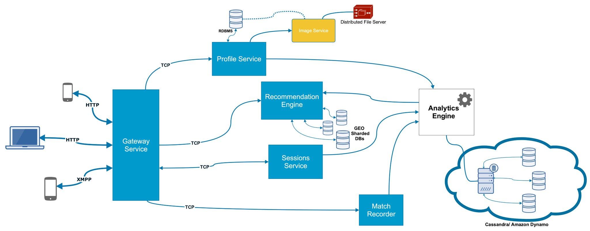

# Tinder: Image Handling System

## Features required
Ask the interviewer whether these features are required:
1. **Storing Profile:** Images will be stored in the profile. How many images per user - let us say 5.
2. **Storing Matches:** Some percentage of active users, say 0.1%.
3. **Direct Messaging**
4. **Recommending Matches:** Number of active users?

They are probably going to say yes to first few features. So, use the order with which you are most comfortable. Also, don't take-up too many features as it will consume a lot of time.

Lastly, ask about the scale at which the application is to be used, the user base etc.

## Storing Images: File vs Blob
The total number of Images is going to be very large as it is a some multiple of the number of users (5 x Users in our case). The question is whether we want to store those images as a **File in a Distributed File System** or as a **Blob (Binary Large Objects) in a DB**.

### Why store in FileSystem?
1. Read/write to a DB is always slower than a file system. If you store large files in DB, then it may slow down the performance because a simple query to retrieve the list of files or filename will also load the file data if you used `select *` in your query. In a file system, accessing a file is quite simple and light weight.
2. Your DB backups become huge, which makes restoration & replication slower. (It is a problem where daily size is in TBs)
3. Access to the files now requires going through your Application and Database layers. (It increases the application memory requirements).
4. Allows usage of lightweight web-server/CDN/Amazon S3 for serving.
5. Cost effective, file servers are much cheaper compared to database.
6. Avoids database overhead with its CRUD operations.
7. Easier in cases where files (images, video, audio etc) are to be shared with third party providers.

### Why store files in DB?
1. DB provides ACID compliance(Atomicity, Consistency, Isolation, Durability) for each row.
2. DB provides data integrity between the file and its metadata.
3. Database Security is available by default.
4. Backups automatically include files, no extra management of file system necessary.
5. Database indexes perform better than file system trees when more number of items are to be stored.
6. File deletion/updation is always in sync with row operations, no extra maintenance needed.

### Conclusion
It is better to use File system if:
* Your application is responsible for handling large files (i.e. over 5MB) and the lots of file uploads.
* Your application will have a large number of users.

It is better to use DB if:
* Your user’s file needs to be more tightly coupled, secured, and confidential.
* Your application will not demand a large number of files from a large number of users.

## Profiles, Images and Gateway Services
* Using the above conclusions, we will be using File System to store profile images.
* Our DB will store ImageId, ImageURL and ProfileId. The ImageURL is the URL of the Distributed File System where the image is stored.
* The user can talk to our ***Profile Service*** to register, update his profile, upload new image etc. All of these requests must be accompanied by a user token for authentication and authorization.
* We can actually improve this design by introducing a ***Gateway Service*** which handles all the communication with the Client. All other services must receive requests from Client and send responses to them via the ***Gateway Service***.
* It is the job of the ***Gateway Service*** to ask the ***Profile Service*** whether the request is authenticated or not. This tells the ***Gateway Service*** whether to respect the request or not. If the request is to be respected, the request will be directed to the correct service. Once the  ***Gateway Service*** receives the response, it will be sent to the client.
* Another functionality we can decouple from ***Profile Service*** is storing images. We can create an ***Image Service*** for this.
* The ***Image Service*** will have access to a ***Distributed File System*** where it will store the images. It will also have a DB to store ImageId, ImageURL and ProfileId.

## Storing Matches
* The first question to ask is: Why not store this info on the Client app.
  * One of the problems is that the Server should be the source of the truth. 
  * In case a Client uninstalls their app, they shouldn't lose all their matches.
* Matches can be handled by ***Matching Service***. It will just keep a table of User A to User B. Here, both users have matched with the other.
* Indexes will be put on each user-id.
* As for the people you accepted (but have not yet matched to) or rejected, this info can be stored at the Client side. It is not a critical info. So, there should not be a problem if we lose it.

## Direct Messaging
* Already Discussed in `Chat Messaging System`.
* There will be some communication between the ***Sessions Service*** and ***Matching Service*** as the Sessions service wants to know if User A is allowed to send a Direct Message to User B. 

## Recommending Matches
* Recommendation needs to be done on the basis of *Location*. So, we need to figure out: Who are the users close to me?
* The other two criteria are *Gender* I am interested in and the *Age-group* I am interested in.
* We need to Shard the data based on the *Location*. It doesn't needs to be the whole city, we can divide the city into chunks (see Uber design).
* Based on location, we can pull the data from the DB and then filter out the correct *Age-group* and *Gender* using a call to ***Profile Service***.
* We will use NoSQL Databases for Recommendation DB as this data will get updated every hour or so. It will have keys `UserId` and `Current Location`.
* This DB will be used by the ***Recommendation Service***. The Client-app will push `Current location` every hour or so.

## Architecture

## Source
* https://www.youtube.com/watch?v=tndzLznxq40
* https://medium.com/@vaibhav0109/should-i-use-db-to-store-file-410ee22268c7
* https://dzone.com/articles/which-is-better-saving-files-in-database-or-in-fil
