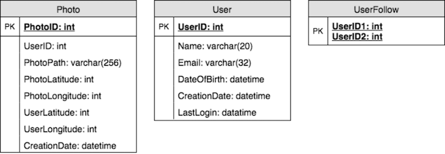
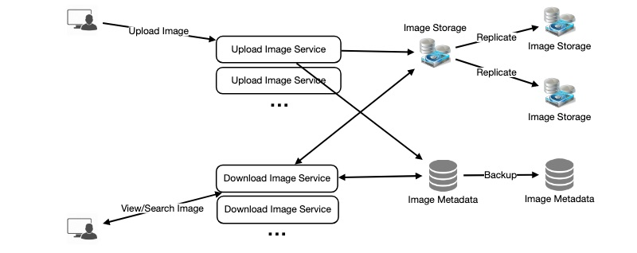

# Instagram: Design of News Feed

## Features required

### Functional Requirements
1. Users should be able to upload/download/view photos.
2. Users can perform searches based on photo/video titles.
3. Users can follow other users.
4. The system should be able to generate and display a user’s News Feed consisting of top photos from all the people the user follows.

### Non-functional Requirements
1. Our service needs to be highly available.
2. Low latency is expected for viewing photos and News Feed generation.
3. Consistency can take a hit (in the interest of availability), if a user doesn’t see a photo for a while; it should be fine.
4. The system should be highly reliable; any uploaded photo or video should never be lost.

**Not in scope:** Adding tags to photos, searching photos on tags, commenting on photos, tagging users to photos, who to follow, etc.

## Design Considerations
* The system would be read-heavy, so we will focus on building a system that can retrieve photos quickly.
* Practically, users can upload as many photos as they like. Efficient management of storage should be a crucial factor while designing this system.

## Capacity Estimation and Constraints
* Let's assume we have 500M total users, with 1M daily active users.
* 2M new photos every day, 23 new photos every second.
* Average photo file size => 200KB
* Total space required for 1 day of photos: 2M * 200KB => 400 GB
* Total space required for 10 years: 400GB * 365 (days a year) * 10 (years) ~= 1425TB 

## High Level System Design
At a high-level, we need to support two scenarios, one to upload photos and the other to view/search photos. Our service would need some object storage servers to store photos and also some database servers to store metadata information about the photos.

## Database Schema
* We need to store data about users, their uploaded photos, and people they follow. 
* ***Photo table*** will store all data related to a photo; we need to have an *index* on (PhotoID, CreationDate) since we need to fetch recent photos first.
* A straightforward approach for storing the above schema would be to use an RDBMS like MySQL since we require joins. But relational databases come with their challenges, especially when we need to scale them.
* We can store photos in a distributed file storage like HDFS or S3.
* We can store the above schema in a distributed key-value store to enjoy the benefits offered by NoSQL. All the metadata related to photos can go to a table where the 'key' would be the *PhotoID* and the 'value' would be an object containing *PhotoLocation*, *UserLocation*, *CreationTimestamp*, etc.
* We need to store relationships between users and photos, to know who owns which photo. We also need to store the list of people a user follows. 
* For both of these tables, we can use a wide-column datastore like Cassandra. For the *UserPhoto* table, the 'key' would be *UserID* and the 'value' would be the list of *PhotoIDs* the user owns, stored in different columns. We will have a similar scheme for the *UserFollow* table.
* Cassandra or key-value stores in general, always maintain a certain number of replicas to offer reliability. Also, in such data stores, deletes don’t get applied instantly, data is retained for certain days (to support un-deleting) before getting removed from the system permanently.

## Component Design
* Photo uploads (or writes) can be slow as they have to go to the disk, whereas reads will be faster, especially if they are being served from cache.
* We should keep in mind that web servers have a connection limit before designing our system. If we assume that a web server can have a maximum of 500 connections at any time, then it can’t have more than 500 concurrent uploads or reads. 
* Uploading users can consume all the available connections, as uploading is a slow process. This means that 'reads' cannot be served if the system gets busy with all the write requests. 
* To handle this bottleneck we can split reads and writes into separate services. We will have dedicated servers for reads and different servers for writes to ensure that uploads don’t hog the system.
* Separating photos’ read and write requests will also allow us to scale and optimize each of these operations independently.
* Losing files is not an option for our service. Therefore, we will store multiple copies of each file so that if one storage server dies we can retrieve the photo from the other copy present on a different storage server. Redundancy removes the single point of failure in the system.

## Data Sharding
We can use two different schemes for metadata sharding: Based on UserID and Based on PhotoID.

### Partitioning based on UserID

* Let’s assume we shard based on the *UserID* so that we can keep all photos of a user on the same shard. 
* If one DB shard is 1TB, we will need four shards to store 3.7TB of data. 
* Let's assume for better performance and scalability we keep 10 shards.
* So we’ll find the Shard number by `UserID % 10` and then store the data there. 
* To uniquely identify any photo in our system, we can append shard number with each PhotoID.
* How can we generate PhotoIDs? Each DB shard can have its own auto-increment sequence for PhotoIDs and since we will append ShardID with each PhotoID, it will make it unique throughout our system.

**What are the different issues with this partitioning scheme?**
* How would we handle hot users? Several people follow such hot users and a lot of other people see any photo they upload.
* Some users will have a lot of photos compared to others, thus making a non-uniform distribution of storage.
* What if we cannot store all pictures of a user on one shard? If we distribute photos of a user onto multiple shards will it cause higher latencies?
* Storing all photos of a user on one shard can cause issues like unavailability of all of the user’s data if that shard is down or higher latency if it is serving high load etc.

### Partitioning based on PhotoID 
* If we can generate unique PhotoIDs first and then find a shard number through `PhotoID % 10`, the above problems will have been solved. We would not need to append ShardID with PhotoID in this case as PhotoID will itself be unique throughout the system.
* How can we generate PhotoIDs? Here we cannot have an auto-incrementing sequence in each shard to define PhotoID because we need to know PhotoID first to find the shard where it will be stored. 
* One solution could be that we dedicate a separate database instance to generate auto-incrementing IDs. If our PhotoID can fit into 64 bits, we can define a table containing only a 64 bit ID field. 
* So whenever we would like to add a photo in our system, we can insert a new row in this table and take that ID to be our PhotoID of the new photo.

**Wouldn’t this key generating DB be a single point of failure?**
* Yes, it would be. A workaround for that could be defining two such databases with one generating even numbered IDs and the other odd numbered.
* We can put a load balancer in front of both of these databases to round robin between them and to deal with downtime. Both these servers could be out of sync with one generating more keys than the other, but this will not cause any issue in our system. 
* We can extend this design by defining separate ID tables for Users, Photo-Comments, or other objects present in our system.
* Alternately, we can implement a 'key' generation scheme similar to what we have discussed in 'URL shortener'.

### How can we plan for the future growth of our system? 
* We can have a large number of logical partitions to accommodate future data growth, such that in the beginning, multiple logical partitions reside on a single physical database server. 
* Since each database server can have multiple database instances on it, we can have separate databases for each logical partition on any server. So whenever we feel that a particular database server has a lot of data, we can migrate some logical partitions from it to another server. 
* We can maintain a config file (or a separate database) that can map our logical partitions to database servers; this will enable us to move partitions around easily. Whenever we want to move a partition, we only have to update the config file to announce the change.

## Source
* https://www.educative.io/courses/grokking-the-system-design-interview/m2yDVZnQ8lG
* https://www.youtube.com/watch?v=QmX2NPkJTKg
