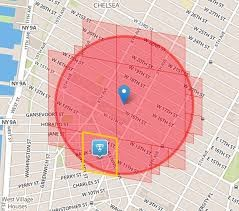
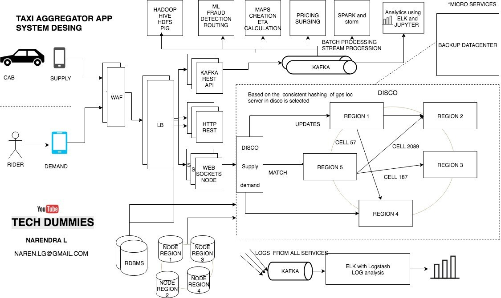

# Uber Design
* Uber’s Dispatch system acts like a real-time market platform that matches drivers with riders using mobile phones.
* So we need two services:
  1. Supply service: Cabs.
  2. Demand service: Riders.

## Supply Service
* The Supply Service tracks cars using geo-location (lat and lang). 
* Every cab which is active keeps on sending lat-long to the server every 5 sec.
* To track vehicles, there are many attributes to model: number of seats, type of vehicle, the presence of a car seat for children, can a wheelchair fit and so on.
* Allocation needs to be tracked. e.g. a vehicle may have three seats but two of those are occupied.

## Demand Service
* The Demand Service tracks the GPS location of the user when a ride is requested.
* It tracks requirements of the orders like small car/big car/car pool etc.
* Demand requirements must be matched against supply inventory.

## DISCO — DISPATCH optimization
* Now we have supply and demand, all we need is a service which matches the demand to a supply and that service in Uber is called as DISCO.
* Core requirements of the dispatch system:
  1. Reduce extra driving.
  2. Reduce waiting time.
  3. Lowest overall ETA.

## Matching Riders to Drivers
* GPS/location data is what drives the Dispatch System. We have to model our maps and location data.
* The earth is a sphere. It’s hard to do summarization and approximation based purely on longitude and latitude. So Uber divides the earth into tiny cells using the Google S2 library. Each cell has a unique *CellId*.
* S2 can give the coverage for a shape. If you want to draw a circle with a 1km radius centered on London, S2 can tell what cells are needed to completely cover the shape.

* Since each cell has an *CellId*, the *CellId* is used as a sharding key. When a location comes in from Supply Service, the *CellId* for the location is determined. The location of the supply is updated and it is then sent out to a few replicas.
* The system filters all cabs by rider's GPS location data to get nearby cabs that meet riders requirements. Using the CellIds from the circular-area, all the relevant shards are contacted to return supply data.
* Then the list and requirements are sent to Routing/ETA Service to compute the ETA of how nearby they are by the road system (not geographically).
* Routing Service sorts them by ETA then sends response back to Supply Service to offer the ride to the drivers in the same order.
* The Client server communication can happen over WebSockets (see Chat Messaging System).

## Sources
* https://medium.com/@narengowda/uber-system-design-8b2bc95e2cfe
* https://www.youtube.com/watch?v=umWABit-wbk
