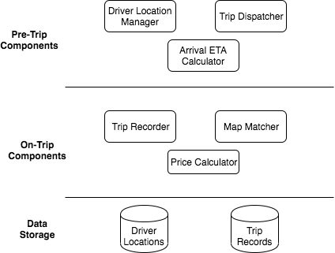
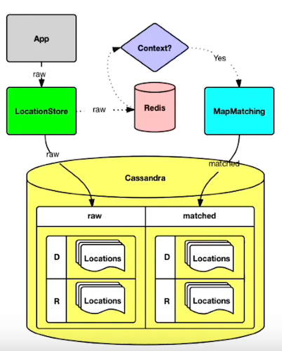

# Uber Design

## Features required
* Riders should be able to view the available drivers in nearby locations.
* Riders should be able to request rides from source to destination.
* Nearby drivers will be notified of the ride, and one of them will confirm the ride
* Pickup ETA will be shown to customers when a ride is dispatched to pick up the rider.
* Once the trip gets completed, the rider is shown the trip details such as the trip map, price, and so forth in the ride receipt.

## Components

1. __Driver Location Manager:__ This component will be responsible for maintaining the changing driver locations. It will ingest the messages emitted by the drivers' Uber app containing their current locations and update the car location index.
2. __Trip Dispatcher:__ It will be responsible for handling the trip requests from users and dispatch a driver in response to those requests.
3. Arrival ETA Calculator: This component will be responsible for calculating the ETA for the driver to reach the rider once the driver has accepted the ride.
4. __Trip Recorder:__ It will record the GPS signals transmitted from the ride when the trip is in progress. These GPS signals will then be recorded in a data store which will be used by subsequent systems such as Map Matcher and Pricing Calculator.
5. __Map Matcher:__ This component will be responsible for matching the trip on the actual map using algorithms specialized for this purpose.
6. __Price Calculator:__ It will use the recorded trip information for computing the price which users have to pay for the trip.

The components mentioned above can be grouped into three major categories: ***Pre-Trip Components***, ***On-Trip Components***, and ***Data Storage***.

## Pre-Trip Components
* This component will be supporting the functionality to see the cars in the nearby locations and dispatching the ride on users' requests. 

### Driver Location Manager
* _Driver Location Manager_ tracks cars using geo-location (lat and lang). Every cab which is active keeps on sending lat-long to the server every 5 sec.
* To track vehicles, there are many attributes to model: number of seats, type of vehicle, the presence of a car seat for children, can a wheelchair fit and so on.
* Allocation needs to be tracked. e.g. a vehicle may have three seats but two of those are occupied.
* The location of the cars can be stored in an in-memory car location index (explained in a later section), which can support high read and write requests. 
* The driver app will keep on sending the updated car locations, which will be updated in this index. 
* The index will be queried when rider app requests for nearby car locations or places a ride request. 
* There are three sequences of operations before a trip starts: 
  1. __Update Driver Location:__ Updating the driver locations as drivers keep changing their locations.
  2. __List nearby drivers:__ Steps involved in fetching the list of nearby drivers.
  3. __Requesting for a ride:__ Steps involved in requesting and dispatching a ride.

### Car Location Index
* We will maintain the driver locations in a distributed index, which is spread across multiple nodes. 
* The driver information containing their locations, the number of people in the car, and if they are on a trip is aggregated as objects. 
* These driver objects are distributed across the nodes using some sharding mechanism (e.g., city, product, and so forth) along-with replication.
* Each node maintains a list of drivers objects. They are queried in real-time to fetch the list of nearby drivers. 
* These objects are updated when the driver app sends updates about their location or any other related information. 
* Some interesting characteristics of this index are listed below:
  * It should store the current locations of all drivers and should support fast queries by location and properties such as driver’s trip status.
  * It should support a high volume of reads and writes.
  * The data stored in these indexes will be ephemeral, and we don’t need long-term durable storage.

### Trip Dispatcher: Matching Riders to Drivers
* The Trip Dispatcher tracks the GPS location of the user when a ride is requested.
* It tracks requirements of the orders like small car/big car/car pool etc.
* Demand requirements must be matched against supply inventory.
* GPS/location data is what drives the Trip Dispatcher. We have to model our maps and location data.
* The earth is a sphere. It’s hard to do summarization and approximation based purely on longitude and latitude. So Uber divides the earth into tiny cells using the Google S2 library. Each cell has a unique *CellId*.
* S2 can give the coverage for a shape. If you want to draw a circle with a 1km radius centered on London, S2 can tell what cells are needed to completely cover the shape.

* Since each cell has an *CellId*, the *CellId* is used as a sharding key. When a location comes in from Supply Service, the *CellId* for the location is determined. The location of the supply is updated and it is then sent out to a few replicas.
* The system filters all cabs by rider's GPS location data to get nearby cabs that meet riders requirements. Using the CellIds from the circular-area, all the relevant shards are contacted to return supply data.
* Then the list and requirements are sent to Routing/ETA Service to compute the ETA of how nearby they are by the road system (not geographically).
* Routing Service sorts them by ETA then sends response back to Supply Service to offer the ride to the drivers in the same order.
* The Client server communication can happen over WebSockets (see Chat Messaging System).

### ETA Calculator
* We need to show the pickup ETA to users once their ride has been dispatched by taking factors such as route and traffic into account. 
* The two primary components of estimating an ETA given an origin and destination on a road network include:
  1. Computing the route from origin to destination with the least cost (which is a function of time & distance)
  2. Estimate the time taken to traverse the route.
* We can start by representing the physical map by a graphical representation to facilitate route computation. We do this by modeling every intersection by node and each road segment by a directed edge.
* We can use routing algorithms such as Dijkstra’s algorithm to find the shortest path between source and destination. However, the caveat associated with using Dijkstra’s algorithm is that the time to find the shortest path for 'N' nodes is O(N log N), which renders this approach infeasible for the scale at which these ride-hailing platforms function. 
* We can solve this problem by partitioning the entire graph, pre-computing the best path within partitions, and interacting with just the boundaries of the partitions. This approach can help in significantly reducing the time complexity.
* Once we are aware of the optimal route, we find the estimated time to traverse the road segment by taking traffic into account. This is a function of time, weather, and real-life events. 
* We use this traffic information to populate the edge weights on the graph.

## How Cabs sends location and how are these saved?
* Since these locations come every 5 seconds from a lot of Cabs, we need a efficient mechanism to save the location.
* Apache Kafka is used as the data hub. Cabs uses Kafka's APIs to send there accurate GPS locations to the data-center.
* Once the GPS locations are loaded to Kafka they are slowly persisted to the main memory of the respective worker nodes. They are also sent to the DB when the trip is happening.

## How do Maps and Routing work?
Before Uber launches operations in a new area, we define and onboard a new region to our map technology stack. Inside this map region, we define sub-regions labeled with grades A, B, AB, and C, as follows:
1. **Grade A:** A subregion of Uber Territory covering urban centers and commute areas that makeup approximately 90 percent of all expected Uber traffic. With that in mind, it is of critical importance to ensure the highest map quality of grade A map regions.
2. **Grade B:** A subregion of Uber Territory covering rural and suburban areas that might be less populated or less traveled by Uber customers.
3. **Grade AB:** A union of grade A and B subregions.
4. **Grade C:** A set of highway corridors connecting various Uber Territories.

## How Uber builds the Map?
### Trace coverage 
* Trace coverage identifies missing road segments or incorrect road geometry. 
* The computation uses two inputs: map data under testing and historic GPS traces of all Uber rides taken over a certain period of time. 
* We overlay those GPS traces onto the map, comparing and matching them with road segments. 
* If we find GPS traces where no road is shown, we can infer that our map is missing a road segment and take steps to fix the deficiency.

### Preferred access (pick-up) point accuracy
* Pick-up points are an extremely important metric to the rider experience, especially at large venues such as airports and stadiums. 
* For this metric, we compute the distance of an address or place's location from all actual pick-up and drop-off points used by drivers. 
* We then set the closest actual location to be the preferred access point for the said location pin. 
* When a rider requests the location indicated by the map pin, the map guides the driver to the preferred access point. 
* We continually compute this metric with the latest actual pick-up and drop-off locations to ensure the freshness and accuracy of the suggested preferred access points.

## How ETAs are calculated?
* DISCO should track the cabs which are ready for customers but also the cabs that are about to finish a ride.
* It is better to allocate a cab which is about to finish a trip near the rider than the cab which is far away from the rider. Sometimes, we can consider revising the route of an ongoing trip because some cab near to demand came online.
* We can use Google Maps APIs and historical travel times to calculate ETAs.
* We can also use Driver's GPS location data to predict traffic condition at any given road, as there are many uber cabs on the road which is sending GPS locations every 5 seconds.
* The whole road network is modeled as a graph. Nodes represent intersections, and edges represent road segments. The edge weights represent a metric of interest: often either the road segment distance or the time take it takes to travel through it. Concepts such as one-way streets, turn restrictions, turn costs, and speed limits are modeled in the graph as well.
* One way to find the best route is the Dijkstra’s search algorithm.
* [OSRM](https://en.wikipedia.org/wiki/Open_Source_Routing_Machine) is based on [Contraction Hierarchies](https://en.wikipedia.org/wiki/Contraction_hierarchies). Systems based on contraction hierarchies achieve fast performance — taking just a few milliseconds to compute a route — by preprocessing the routing graph.

## On-Trip/Post-Trip Component
* This component handles the processes which are involved from start to completion of the trip. 
* It keeps track of the locations of the ride when the trip is in progress. It also is responsible for generating the map route and computing the trip cost when it gets completed.
* The driver app publishes GPS locations when the ride is in progress, which is consumed by the Trip Recorder through Kafka streams and persisted in the Location Store. 
* Upon trip completion, Map Matcher generates the map route using raw GPS locations.

### Location Store/Data Model
* This storage component will be responsible for storing the stream of GPS locations sent by the rider/driver app while the trip is in progress. 
* Some of the characteristics of this store are listed below:
  1. It should support a high volume of writes.
  2. The storage should be durable.
  3. It should support time-series based queries such as the location of the driver in a given time range.
* We can use a datastore such as Cassandra for persisting the driver locations, thereby ensuring long-term durability. 
* We can use a combination of <DriverUUID, Timestamp> as the partition key for storing the driver locations in the data store. This ensures that the driver locations are ordered by timestamp and can support time-based queries. 

### Map Matcher
* This module takes in raw GPS signals as input and outputs the position on the road network. 
* The input GPS signals comprise of latitude, longitude, speed, and course. On the other hand, the positions on a road network consisting of latitude (on an actual road), longitude (on a actual road), road segment id, road name, and direction/heading. 
* This is a challenge in itself as the raw GPS signals can be far away from the actual road network. 
* The map route generated by Map Matcher is used for two significant use-cases:
  1. Finding the actual position of the driver on the road network
  2. Calculating the fare prices.

## Optimizations
* One of the problems with the proposed design is that both the heavy reads and writes are directed to the data store. We can optimize the system by separating the read traffic from the writes by caching the raw driver locations in a distributed cache (Redis). 
* The raw driver locations from the Redis cache is leveraged by MapMatcher to create the matched map and persist it in the data-store.

## Post-trip actions
Once the trip is completed we need to do these actions by scheduling:
* Collect ratings
* Send emails
* Update databases
* Schedule payments

## Price and Surge
* The price is increased when there are more demand and less supply with the help of prediction algorithms.
* Surge helps to meed supply and demand. If we increase the price when the demand is more, more cabs will come on the road.

## Sources
* https://medium.com/@narengowda/uber-system-design-8b2bc95e2cfe
* https://techtakshila.com/system-design-interview/chapter-3
* https://www.youtube.com/watch?v=J3DY3Te3A_A
