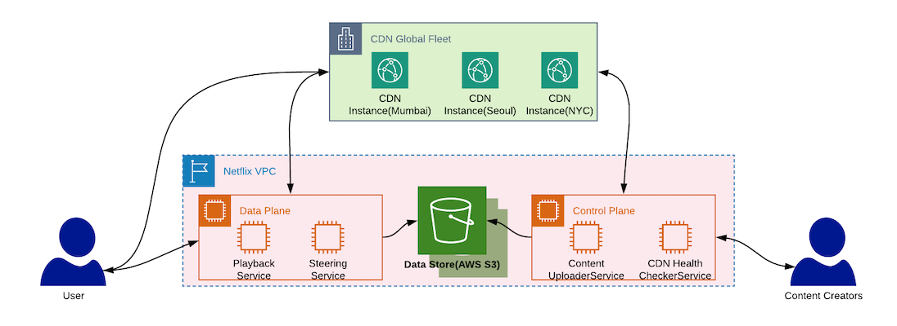

# Netflix Design

## Features required
* Uploading content.
* The viewers are able to watch the video on different platforms (TV, mobile-app, etc).
* Users should be able to search videos based on the video titles.
* The system should support sub-titles for the videos as well.
* The mechanism to recommend personalized videos to different users.
* The billing and subscription model for watching the videos.

## Capacity Planning
    Number of active users registered with the application = 100 Million
    Average size of the video content uploaded every minute = 2500 MB
    Total combinations of resolution and codec formats which need to be supported = 10
    Average number of videos users watch daily = 3
* Netflix comprises of multiple Microservices. However, the playback service responsible for responding to user playback queries will get the maximum traffic. So, it requires the maximum number of servers. We can calculate the number of servers required for handling the playback requests by using the equation mentioned below.
* Servers in Playback Microservice = #(playbacks requested per second) * Latency/ #(concurrent connections per server)
* Let's assume that the latency (time taken to respond to user requests) of the playback service is 20 milliseconds and each server can support a maximum of 10K connections. Additionally, we need to scale the application for a peak traffic scenario where 75% of active users place playback requests. In such a scenario, we will need a total of 150 servers( = 75M * 20ms / 10K).
* Number of videos watched per second= #(active users) * average videos watched daily / 86400 = 3472(100M * 3/86400)
* Size of the content stored on a daily basis = #average size of video uploaded every min * #pairwise combination of resolutions and codecs * 24* 60 = 36 TB/day (= 2500MB * 10 * 24 * 60)

## High Level Design
* Netflix uses Amazons Elastic Load Balancer (ELB) service to route traffic to our front-end services. ELBs are set up such that load is balanced across zones first, then instances. This is because the ELB is a two-tier load balancing scheme.
  1. The first tier consists of basic DNS based round robin load balancing. This gets a client to an ELB endpoint in the cloud that is in one of the zones that your ELB is configured to use.
  2. The second tier of the ELB service is an array of load balancer instances (provisioned directly by AWS), which does round-robin load balancing over our own instances that are behind it in the same zone.
* One of the major design goals of the Netflix architecture’s is ***Stateless Services***. These services are designed such that any service instance can serve any request in a timely fashion and so if a server fails it is not a big deal. In the failure, case requests can be routed to another service instance and we can automatically spin up a new node to replace it. 
* __EVCache:__ When a node goes down all the cache goes down along with it. So, the performance hit until all the data is cached. To deal with this, Netflix came up with ***EVcache***. It is a wrapper around Memcached but it is sharded.
* The entire system can be divided into the following components:

### Content Delivery Network (CDN)
* It is responsible for storing the content in the locations which are geographically closest to users. 
* This significantly enhances the user experience as it reduces the network and geographical distances that our video bits must travel during playback. 
* It also reduces the overall demand on upstream network capacity by a great extent.
* **Open Connect** is the global customized CDN for Netflix that delivers Netflix TV shows and movies to members world-wide. This essentially is a network of thousands of Open Connect Appliances (OCAs) which store encoded video/image files and is responsible for delivering the playable bits to client devices. 
* OCAs are made up of tuned hardware and software which are deployed on the ISP site and custom tailored to provide optimal customer experience.

### Control Plane
* This component will be responsible for uploading new content which will eventually be distributed across the CDNs. 
* It will also be responsible for things such as file storage, sharding, data storage and interpretation of relevant telemetry about the playback experience. 
* The major Microservices in this component are listed below.
  1. **CDN Health Checker Service:** This microservice will be responsible to periodically check health of the CDN service, learn about the overall playback experience, and work towards optimizing it.
  2. **Content Uploader Service:** This microservice will consume the content provided by content generators and distribute it across the CDNs to ensure robustness and optimal playback experience. It will also be responsible for storing the metadata of video content in data-storage.
  3. **Title Indexer**: Indexes video for search.

### Data Storage
* The video metadata (title, description etc.) is persisted in the data-storage. 
* We will also persist the subtitle information in the optimal database.

### Data Plane
* This is the component with which the end users interact while playing a video content. 
* This component gets requests from different media streaming platforms (TV, mobile, tablet etc.) and returns the urls of the CDNs from which the requested files can be served. 
* It will comprise of two major microservices:
  1. **Playback Service:** This microservice is responsible for determining the specific files which are required for serving a playback request.
  2. **Steering Service:** This service determines the optimal CDN urls from which the requested playback can be fetched from.

### Bird’s Eye-View of the overall System

1. Upload the video content to the *Control Plane*.
2. The video content gets uploaded on the *CDN* which are placed geographically closer to end users.
3. The CDN reports the status to the Control Plane such as health metrics, what files they have stored, the optimal BGP routes and so forth.
4. The video metadata and the related CDN information gets persisted in the *Data Storage*.
5. A user on the client device places the request to play a particular title (TV show or movie).
6. *Playback Service* determines the files which are required to playback a specific title.
7. The *Steering Service* picks the optimal CDN from which the required files can be fetched from. It generates the urls of such CDN and provide it to back to the client device.
8. Client device requests the CDN to serve the requested files.
9. CDN serves the requested files to the client device which gets rendered to the users.

## Content Uploader
* This module is executed when a content is uploaded. It is responsible for distributing the content on CDN to provide optimal customer experience.
* Sequence of operations that gets executed when video content (TV Show or movie) is uploaded:
  1. Raw video content is uploaded.
  2. The ***Content Storage Service*** segments the raw video file into chunks and persists those segments on the ***File Storage System***.
  3. The ***Video Encoder*** encodes each of the segments in different codec and resolution.
  4. The encoded file segments are stored in the File storage.
  5. The ***Video Distributor*** reads the encoded file segments from the distributed ***File Storage System***.
  6. The ***Video Distributor*** distributes the encoded file segments in CDN.
  7. The ***Video Distributor*** persists the CDN url links of the videos in the ***Data Storage***.

### Video Encoder/Transcoder
* The encoder works by splitting the video file into smaller video segments. These video segments are encoded in all possible combinations of codecs and resolutions. 
* In our example, we can plan on supporting four codecs(Cinepak, MPEG-2, H.264, VP8) and three different resolutions(240p, 480p, 720p). This implies that each video segment gets encoded in a total of 12 formats(4 codecs * 3 resolutions). 
* These encoded video segments are distributed across the CDN and the CDN url is maintained in the data store. 
* The ***Playback Service*** is responsible for finding the most optimal CDN url based on the input parameters(client’s device, bandwidth, and so forth) of user requests.
* Netflix’s media processing platform is used for video encoding(FFmpeg), title image generation, media processing(Archer) and so forth. They have developed a tool called *MezzFS* which collects metrics on data throughput, download efficiency, resource usage, etc. in *Atlas*, Netflix’s in-memory time-series database. They use this data for developing optimizations such as replays and adaptive buffering.

## CDN Health Checker
* This module ingests the health metrics of the CDNs and persists them in the data storage. This data is used by the ***Data Plane*** to get optimal CDN urls when users request playback.
* Sequence of operations which gets executed to get statistics around the CDN health metrics and the BGP routes:
  1. The cron job triggers the microservice ***CDN Health Checker Service***. This service is responsible for checking the health of CDNs and collect health metrics and other information.
  2. The ***CDN Health Checker Service*** persists the CDN info in the ***Data Store*** which is then used in the ***Data Plane*** to find the optimal CDNs from which files can be served based on their file availability, health, and network proximity to the client.

## Title Indexer
* This module is responsible for creating the indexes of the video titles. It then updates them in the ***Elastic Search*** to enable faster content discovery for end users.
* Sequence of operations required for indexing the video titles for searching video content:
  1. The cron-job triggers the ***Title Indexer Service*** to index the video titles. This service fetches the newly uploaded content from the ***Data Store*** and applies the business rules to create indexes for the video titles.
  2. ***Title Indexer Service*** updates ***Elastic Search*** with the indexes of the video titles making the titles easily searchable.

## Playback Workflow
* This workflow is responsible for orchestrating operations when a user places a playback request. 
* It coordinates between different microservices such as ***Authorization Service*** (for checking user authorization and licensing), ***Steering Service*** (for deciding the best playback experience) and ***Playback Experience Service*** (for tracking the events to measure playback experience). 
* ***Steering Service*** ensures the best customer experience by finding the most optimal CDN url based on user request such as user’s device, bandwidth and so forth. 
* The orchestration process will be handled by the ***Playback Service***.
* Sequence of operations:
  1. The client places a request to playback a video which gets directed to the ***Playback Service***.
  2. The ***Playback Service*** calls the ***Authorization Service*** to authenticate users request.
  3. The ***Playback Service*** calls the ***Steering Service*** to pick the CDN url from which the playback can be served.
  4. The CDN url is returned to the client(mobile/TV).
  5. The client retrieves the content from CDN.
  6. The client publishes the events for the playback experience to the ***Playback Service***.
  7. The ***Playback Service*** tracks events to measure the playback experience by calling the ***Playback Experience Service***.
  8. We constantly check for best streaming server and bitrate for you and switches between formats and servers to give the best viewing experience for the users.

## Content Lookup (Search) Workflow
* This workflow is triggered when user searches for a video title.
* It comprises of two microservices: ***Content Discovery Service*** and ***Content Similarity Service***. 
* The ***Content Discovery Service*** gets invoked when user requests for the video title. On the other hand, the ***Content Similarity Service*** returns the list of similar video title if the exact video title doesn’t exist in our data-store.
* Sequence of operations:
  1. The client searches for a video title.
  2. ***The Content Discovery Service (CDS)*** queries the Elastic Search to check if the video title exists.
  3. If the video title can be found in the elastic search then CDS fetches the details of the video from the data store. The video details are returned to the client.
  4. CDS queries the ***Content Similarity Service (CSS)*** if the title doesn’t exist in our database. CSS returns the list of similar video titles to CDS.
  5. CDS fetches the video details from the data-store for those similar video titles.
  6. CDS returns the similar video details to the client.

## Data Storage: SQL
* ***MySQL*** is the choice for the billing/user info use case. 
* They have master-master setup with ***Synchronous replication protocol***. The write operations on the primary node to be considered completed only after both the local and remote writes have been confirmed. As a result, the loss of a single node is guaranteed to have no data loss. This would impact the write latency, but that was well within the SLAs.
* In case of the primary MySQL database failure, a failover is performed to the secondary node that was being replicated in synchronous mode. Once secondary node takes over the primary role, the route53 DNS entry for database host is changed to point to the new primary.
* Read replica set up in local, as well as cross-region, not only to meet high availability requirements, but also to help with scalability.
* Netflix design has a lot of ETL jobs. ***Extract, transform, load (ETL)*** is the general procedure of copying data from one or more sources into a destination system which represents the data differently from the sources. The ETL jobs are often used in Data Warehousing (reporting, data analysis, and business intelligence).
* The read traffic from ETL jobs is diverted to the read replica, sparing the primary database from heavy ETL batch processing. 

## Data Storage: NoSQL
* Netflix uses Cassandra as NoSQL DB. 
* Cassandra is a free and open-source distributed wide column store NoSQL database designed to handle large amounts of data across many commodity servers, providing high availability with no single point of failure.
* At Netflix as user-base started to grow more there has been a massive increase in ***Viewing History data***.
* So Netflix Redesigned data storage arch with two main goals in mind:
  1. Smaller Storage Footprint.
  2. Consistent Read/Write Performance as viewing per member grows.
* _Solution: Compress the old rows!!_
* Data was divided in to two types:
  1. __Live Viewing History (LiveVH):__ Small number of recent viewing records with frequent updates. The data is stored in uncompressed form.
  2. __Compressed Viewing History (CompressedVH):__ Large number of older viewing records with rare updates. The data is compressed to reduce storage footprint. Compressed viewing history is stored in a single column per row key.

## Elastic search
* We have seen explosive growth in Elastic search adoption within Netflix. There are ~150 clusters totaling ~3,500 instances hosting ~1.3 PB of data. The vast majority of the data is injected via data pipeline.
* How its used at Netflix: Say when a customer tried to play a video and he couldn't, he calls the customer care now how customer care personnel wants to debug whats happening. The team uses Elastic search to drill down the problem and also to understand how widespread is the problem. It is also used :
  * To see Signup or login problems
  * To keep track of resource usage

## Movie Recommendation
* Spark is used for content recommendations and personalization. A majority of the machine learning pipelines for member personalization run atop large managed Spark clusters. 
* These models form the basis of the Recommendation System that backs the various personalized canvases you see on the Netflix app including, title relevance ranking, row selection & sorting, and artwork personalization among others.
* Example: when browsing around looking for something to watch on Netflix, there is always an image displayed for each video. This is called the _Header Image_.
* The _Header Image_ is meant to intrigue you, to draw you into selecting a video. The idea is: the more compelling the header image, the more likely you are to watch a video. And the more videos you watch, the less likely you are to unsubscribe from Netflix.
* Netflix uses a number of _Header Images_ and counts every time the video was watched, recording which _Header Image_ was displayed when the video was selected. The more successful a _Header Image_ is in getting clicks, the more it will be displayed.
* [Link](https://beta.vu.nl/nl/Images/werkstuk-fernandez_tcm235-874624.pdf)
* Whenever you access the Netflix service, our ***Recommendations System*** strives to help you find a show or movie to enjoy with minimal effort. We estimate the likelihood that you will watch a particular title in our catalog based on a number of factors including:
  1. Your interactions with our service (such as your viewing history and how you rated other titles).
  2. Other members with similar tastes and preferences on our service.
  3. Information about the titles, such as their genre, categories, actors, release year, etc.

### Collaborative filtering 
* The Collaborative Filtering (CF) algorithms are based on the idea that if two clients have similar rating history then they will behave similarly in the future. 
* If, for example, there are two very similar users and one of them watches a movie and rates it with a good score, then it is a good indication that the second user will have a similar pattern.

### Content-based filtering 
* The Content-based filtering (CB) aims to recommend items or movies that are similar to movies the user has liked before. 
* The main difference between this approach and the CF is that CB offers the recommendation based not only in similarity by rating, but it is more about the information from the products, i.e., the movie title, the year, the actors, the genre. 
* In order to implement this methodology, it is necessary to possess information describing each item, and some sort of user profile describing what the user likes. The task is to learn the user preferences, and then locate or recommend items that are 'similar' to the user preferences.

## Addressing Bottlenecks
* The usage of micro-services comes with the caveat of efficiently handling fallbacks, retries and time-outs while calling other services. 
* We can address the bottlenecks of using distributed systems by using the concepts of Chaos Engineering, interestingly devised at Netflix. We can use tools such as ***Chaos Monkey*** which randomly terminates instances in production to ensure that services are resilient to instance failures.
* We may introduce chaos in the system by using the concepts of ***Failure Injection Testing(FIT)***. 
* This can be done by either introducing latency in the I/O calls or by injecting faults while calling other services. After that, we can implement fallback strategies by either returning latest cached data from the failing service or using a fallback microservice. 
* We can also use libraries such as ***Hystrix*** for isolating the points of access between failing services. Hystrix acts as circuit breakers if the error threshold gets breached. 
* We should also ensure that the retry time-outs, service call time-outs, and the hystrix time-outs are in sync.

## Hystrix
* Hystrix is a latency and fault tolerance library designed to isolate points of access to remote systems, services and 3rd party libraries. 
* It helps in:
  1. Stop cascading failures
  2. Real-time monitoring of configurations changes
  3. Concurrency aware request caching
  4. Automated batching through request collapsing

* i.e., if a microservice is failing then return the default response and wait until it recovers.
* Netflix identifies a few services as _Critical_ and these micro-services works without many dependencies to other services. This is done so that at-least user can see recommended videos and play them, even in case of cascaded service failure.

## Sources
* https://medium.com/@narengowda/netflix-system-design-dbec30fede8d
* https://techtakshila.com/system-design-interview/chapter-2
* https://www.youtube.com/watch?v=CZ3wIuvmHeM
