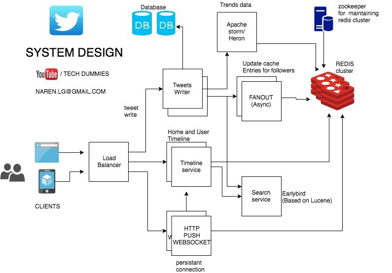
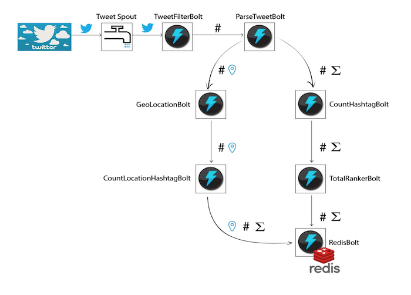

# Twitter

## Features required
* The user should be able to tweet as fast as possible.
* The user should be able to see Tweet Timelines:
  1. __User timeline:__ Displaying user's tweets and retweets.
  2. __Home timeline:__ Displaying Tweets from people user follow.
  3. __Search timeline:__ Display search results based on hashtags or search keyword.
* The user should be able to follow another user
* Users should be able to tweet millions of followers within a few seconds.
* The user should be able to see the trending hashtags.

## Design Considerations
* Twitter now has 300M worldwide active users. Every second on an average, around 6000 tweets are tweeted on Twitter. Also, every second 6,00,000 Queries made to get the timelines.
* So, Twitter is read heavy.
* It is ok to have Eventual consistency. If the User sees the tweets a bit delayed, it is not a big issue.
* Space is not a problem as tweets are limited to 140 characters.

## System Design
* We will use Redis to access most of the information faster and also to store data.
* We will also store a copy of tweet and other User related info in Database.
* Basic Architecture of Twitter service consists of a User Table, Tweet Table, and Followers Table
  * User Information is stored in ***User Table***.
  * When a User tweets, it gets stored in the ***Tweet Table*** along with _UserID_. User Table will have One-to-Many relationships with Tweet Table. 
  * When a user follows another user, it gets stored in ***Followers Table***.
* 

## Sources
* https://medium.com/@narengowda/system-design-for-twitter-e737284afc95
