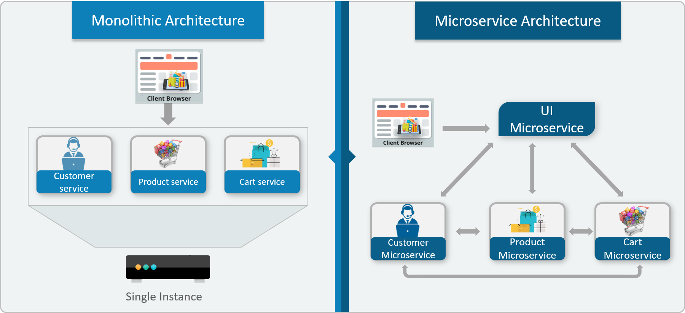

# Microservice Architecture
Go through this article: https://dzone.com/articles/what-is-microservices-an-introduction-to-microserv

## Monolithic Architecture
* Monolithic Architecture is the architecture that prevailed before microservices.
* It is similar to a big container wherein all the software components of an application are assembled together and tightly packaged.

### Pros of Monolithic architecture
1. Monolithic applications are very simple to develop because of all the tools and IDEs support to that kind of application by default.
2. Very easy to deploy because all components are packed into one bundle.
3. Very fast as it uses Function calls instead of Network calls.

### Cons of Monolithic architecture
1. **Inflexible** - Monolithic applications cannot be built using different technologies.
2. **Unreliable** - If even one feature of the system does not work, then the entire system does not work.
3. **Unscalable** - Applications cannot be scaled easily since each time the application needs to be updated, the complete system has to be rebuilt. Also, it is not possible to scale just one part of the application; the whole application must be scaled.
4. **Blocks Continuous Development** - Many features of an application cannot be built and deployed at the same time.
5. **Slow Development** - Development in monolithic applications takes a lot of time to be built since each and every feature has to be built one after the other.
6. **Not Fit for Complex Applications** - Features of complex applications have tightly coupled dependencies.

## Microservice Architecture
* Microservice Architecture is an architectural style that structures an application as a collection of small autonomous services, modeled around a business domain.
* In microservice architecture, each service is self-contained and implements a single business capability.

## Monolithic vs Microservice Architecture
Consider an e-commerce application as a use case to understand the difference between both of them.

The main difference is that all the features were initially under a single instance sharing a single database in the Monolith. However, with Microservices, each feature was allotted a different Microservice, handling their own data, and performing different functionalities.

## Microservice Architecture: Design
* Different clients from different devices try to use different services like search, build, configure, and other management capabilities.
* All the services are separated based on their domains and functionalities and are further allotted to individual microservices.
* These microservices have their own **load balancer** and **execution environment** to execute their functionalities, and at the same time, captures data in their own databases.
* All the microservices communicate with each other through a stateless server which is either **REST** or a **Message Bus**.
* Microservices know their path of communication with the help of **Service Discovery** and perform operational capabilities such as automation and monitoring.
* All the functionalities performed by microservices are communicated to clients via an **API Gateway**.
* All the internal points are connected from the **API Gateway** so anybody who connects to the API Gateway is automatically connected to the complete system.

## Microservice Architecture: Features
* **Decoupling** - Services within a system are largely decoupled, so the application as a whole can be easily built, altered, and scaled.
* **Componentization** - Microservices are treated as independent components that can be easily replaced and upgraded.
* **Business Capabilities** - Microservices are very simple and focus on a single capability.
* **Autonomy** - Developers and teams can work independently of each other, thus increasing speed.
* **Continous Delivery** - Allows frequent releases of software through systematic automation of software creation, testing, and approval.
* **Responsibility** - Microservices do not focus on applications as projects. Instead, they treat applications as products for which they are responsible.
* **Decentralized Governance** - The focus is on using the right tool for the right job. That means there is no standardized pattern or any technology pattern. Developers have the freedom to choose the best useful tools to solve their problems.
* **Agility** - Microservices support agile development. Any new feature can be quickly developed and discarded again.
* **Independent Development** - All microservices can be easily developed based on their individual functionality.
* **Independent Deployment** - Based on their services, they can be individually deployed in any application.
* **Fault Isolation** - Even if one service of the application does not work, the system still continues to function.
* **Mixed Technology Stack** - Different languages and technologies can be used to build different services of the same application.
* **Granular Scaling** - Individual components can scale as per need, there is no need to scale all components together.

## Microservice Architecture: Cons
1. Independent code base maintenance is very difficult.
2. Monitoring the overall system is very challenging because of decentralization. Communication needs to be very strong to communicate with independent modules.
3. Has additional performance overhead because of network latency.

## How to Decompose a Monolith
* Define services corresponding to business capabilities. A business capability is something a business does in order to provide value to its end users.
* Identifying business capabilities and corresponding services requires a high level understanding of the business. 
* For example, the business capabilities for an online shopping application might include the following:
  * Product Catalog Management
  * Inventory Management
  * Order Management
  * Delivery Management
  * User Management
  * Product Recommendations
  * Product Reviews Management
* Once the business capabilities have been identified, the required services can be built corresponding to each of these identified business capabilities.
* Each service can be owned by a different team who becomes an expert in that particular domain and an expert in the technologies that are best suited for those particular services. This often leads to more stable API boundaries and more stable teams.

## Sources
* https://dzone.com/articles/what-is-microservices-an-introduction-to-microserv
* https://www.youtube.com/watch?v=qYhRvH9tJKw
* https://medium.com/hashmapinc/the-what-why-and-how-of-a-microservices-architecture-4179579423a9
