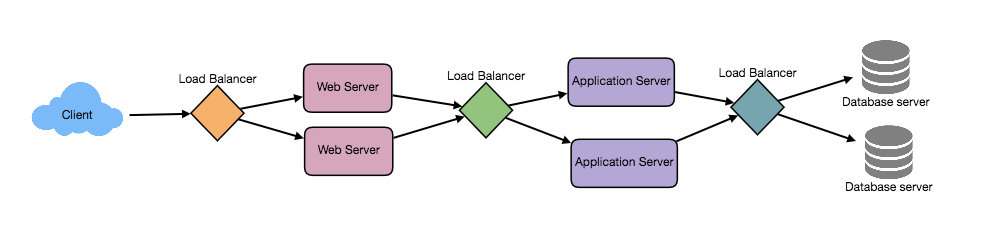
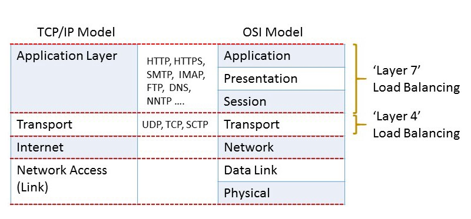

# Load Balancing
* Load Balancer (LB) helps to spread the traffic across a cluster of servers to improve responsiveness and availability of applications, websites or databases. LB also keeps track of the status of all the resources while distributing requests. 
* If a server is not available to take new requests or is not responding or has elevated error rate, LB will stop sending traffic to such a server. 
* Typically a load balancer sits between the client and the server accepting incoming network and application traffic and distributing the traffic across multiple backend servers using various algorithms. 
* By balancing application requests across multiple servers, a load balancer reduces individual server load and prevents any one application server from becoming a single point of failure, thus improving overall application availability and responsiveness.
* To utilize full scalability and redundancy, we can try to balance the load at each layer of the system. We can add LBs at three places:
  1. Between the user and the web server.
  2. Between web servers and an internal platform layer, like application servers or cache servers.
  3. Between internal platform layer and database.

## Benefits of Load Balancing
* Users experience faster, uninterrupted service. Users won’t have to wait for a single struggling server to finish its previous tasks. Instead, their requests are immediately passed on to a more readily available resource.
* Service providers experience less downtime and higher throughput. Even a full server failure won’t affect the end user experience as the load balancer will simply route around it to a healthy server.
* Load balancing makes it easier for system administrators to handle incoming requests while decreasing wait time for users.
* Smart load balancers provide benefits like predictive analytics that determine traffic bottlenecks before they happen. As a result, the smart load balancer gives an organization actionable insights. These are key to automation and can help drive business decisions.
* System administrators experience fewer failed or stressed components. Instead of a single device performing a lot of work, load balancing has several devices perform a little bit of work.

## Load Balancing Algorithms

### How does the load balancer choose the backend server?
Load balancers consider two factors before forwarding a request to a backend server. They will first ensure that the server they choose is actually responding appropriately to requests and then use a pre-configured algorithm to select one from the set of healthy servers. 

### Health Checks
Load balancers should only forward traffic to "healthy" backend servers. To monitor the health of a backend server, "health checks" regularly attempt to connect to backend servers to ensure that servers are listening. If a server fails a health check, it is automatically removed from the pool, and traffic will not be forwarded to it until it responds to the health checks again.

### Load balancing algorithms
There is a variety of load balancing methods, which use different algorithms for different needs.
* ***Least Connection Method —*** This method directs traffic to the server with the fewest active connections. This approach is quite useful when there are a large number of persistent client connections which are unevenly distributed between the servers.
* ***Least Response Time Method —*** This algorithm directs traffic to the server with the fewest active connections and the lowest average response time.
* ***Least Bandwidth Method -*** This method selects the server that is currently serving the least amount of traffic measured in megabits per second (Mbps).
* ***Round Robin Method —*** This method cycles through a list of servers and sends each new request to the next server. When it reaches the end of the list, it starts over at the beginning. It is most useful when the servers are of equal specification and there are not many persistent connections.
* ***Weighted Round Robin Method —*** The weighted round-robin scheduling is designed to better handle servers with different processing capacities. Each server is assigned a weight (an integer value that indicates the processing capacity). Servers with higher weights receive new connections before those with less weights and servers with higher weights get more connections than those with less weights.
* ***IP Hash —*** Under this method, a hash of the IP address of the client is calculated to redirect the request to a server.

## Redundant Load Balancers
The load balancer can be a single point of failure. To overcome this, a second load balancer can be connected to the first to form a cluster. Each LB monitors the health of the other and, since both of them are equally capable of serving traffic and failure detection, in the event the main load balancer fails, the second load balancer takes over.

## L4 and L7 Load Balancers

### L4 Load Balancer
* "Layer 4 load balancing" refers to a deployment where the LB's IP address is the one advertised to clients for a web-site or service (via DNS, for example). As a result, clients record the LB's address as the destination IP address in their requests.
* When the Layer 4 LB receives a request and makes the load balancing decision, it also performs Network Address Translation (NAT) on the request packet, changing the recorded destination IP address from its own to that of the content server it has chosen on the internal network. 
* Similarly, before forwarding server responses to clients, the LB changes the source address recorded in the packet header from the server's IP address to its own. (The destination and source TCP port numbers recorded in the packets are sometimes also changed in a similar way.)
* Layer 4 LBs make their routing decisions based on address information extracted from the first few packets in the TCP stream, and do not inspect packet content.
* Layer 4 load balancing was a popular architectural approach to traffic handling when commodity hardware was not as powerful as it is now, and the interaction between clients and application servers was much less complex. It requires less computation than more sophisticated load balancing methods (such as Layer 7), but CPU and memory are now sufficiently fast and cheap that the performance advantage for Layer 4 load balancing has become negligible or irrelevant in most situations.

### L7 Load Balancer
* Layer 7 load balancing enables ADC (Application Delivery Controllers) to redirect traffic more intelligently by inspecting content to gain deeper context on the application request. This additional context allows the ADC to not only optimize load balancing but to also rewrite content, perform security inspections and to implement access controls.
* Let’s look at a simple example. A user visits a high-traffic website. Over the course of the user’s session, he or she might request static content such as images or video, dynamic content such as a news feed, and even transactional information such as order status. 
* Layer 7 load balancing allows the load balancer to route a request based on information in the request itself, such as what kind of content is being requested. 
* So now a request for an image or video can be routed to the servers that store it and are highly optimized to serve up multimedia content. 
* Requests for transactional information such as a discounted price can be routed to the application server responsible for managing pricing. 
* With Layer 7 load balancing, network and application architects can create a highly tuned and optimized server infrastructure or application delivery network that is both reliable and efficiently scales to meet demand.

## Sources
* https://www.educative.io/courses/grokking-the-system-design-interview/3jEwl04BL7Q
* https://medium.com/system-designing-interviews/system-design-chapter-3-load-balancing-e1c89148e37
* https://www.youtube.com/watch?v=K0Ta65OqQkY&list=PLMCXHnjXnTnvo6alSjVkgxV-VH6EPyvoX&index=3