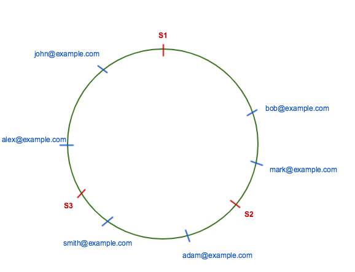

# Consistent Hashing

## Hashing
* Hashing is the process of mapping one piece of data — typically an arbitrary size object to another piece of data of fixed size, typically an integer, known as hash code or simply hash. 
* A function is usually used for mapping objects to hash code known as a *Hash Function*.
* For example, a hash function can be used to map random size strings to some fixed number between 0 and N. Given any string it will always try to map it to any integer between 0 to N.
* Suppose N is 100. Then for example, for any string hash function will always return a value between 0 to 100.
  * Hello          --->   60
  * Hello World    --->   40
* There can be many possible strings which will map to the same integer. This is called *Collision*.
* Suppose we want to store employee records in such a way that, we can perform *Insert*, *Search* and *Delete* operations efficiently.
* Hash function can be used to hash object key (say email) to an integer number of fixed size. Perform modulo operation on hash of the key to get the array index. We can then use array to store the employee details at that index.
  * `index = hash(key) modulo N where N is the size of array.`
* Since there will be many keys which will map to the same index, a list or a bucket is attached to each index to store all objects mapping to the same index.
* Searches in the bucket are linear but a properly size hashed table will have a small number of objects per bucket resulting in constant time access.
* To add a new object, we hash the key, find the index and check the bucket at that index. If the object is not in the bucket then add it.
* To find an object by key, hash the key and get the index and looks for the key in the bucket at that index.

## Distributed Hashing
* Suppose a number of employees kept growing and it becomes difficult to store all employee information in a hash table which can fit on a single computer. In that situation, we will try to distribute the hash table to multiple servers to avoid memory limitation of one server.
* The simplest solution for this is to take the hash modulo of the number of servers.
  * `server = hash(key) modulo N where N is the number of servers.`
* e.g.
  |Email (Key)|Hash|Server|
  | ------ | ------ | ------ | 
  |john@example.com|89|2(S3)|
  |mark@example.com|30|0(S1)|
  |adam@examle.com|47|2(S3)|
  |smith@example.com|52|1(S2)|
  |alex@example.com|75|0(S0)|
  |bob@example.com|22|1(S2)|

## Rehashing/Horizontal Scalability Problem
* The above scheme is not horizontally scalable. If we add or remove servers from the set, all our existing mappings are broken. This is because the value of "N" in our function that calculates the server index changes. The result is that all existing data needs to be remapped and migrated to different servers.
* Suppose we add a new server (S4) to handle more load. Now, N has increased from 3 to 4. Let’s rehash all the keys and see how it looks like:
  |Email (Key)|Hash|Server|
  | ------ | ------ | ------ | 
  |john@example.com|89|1(S2)|
  |mark@example.com|30|2(S3)|
  |adam@examle.com|47|3(S4)|
  |smith@example.com|52|0(S1)|
  |alex@example.com|75|3(S4)|
  |bob@example.com|22|2(S3)|
* The server location for almost all keys changed, i.e. 100% of servers needs to be updated. This is known as ***Rehashing Problem*** or ***Horizontal Scalability Problem***.

##  Data Distribution: "Data Hot Spots" in Cluster
We cannot expect uniform distribution of data coming in all the time. There may be many more keys whose hashValue maps to Server3 than any other servers , in which case Server3 will become a ***Hot-spot*** for queries.

## Consistent Hashing
* Consistent Hashing is a distributed hashing scheme that operates independently of the number of servers or objects in a distributed hash table by assigning them a position on an abstract circle, or hash ring. This allows servers and objects to scale without affecting the overall system.
* Suppose our hash function output range in between zero to 2^32 or `INT_MAX`, then this range is mapped onto the hash ring so that values are wrapped around. All keys and servers are hashed using the same hash function and placed on the edge of the circle. 
* To find out which server to ask for a given key or store a given key, we need to first locate the key on the circle and move in a clockwise direction until we find a server.
  
* According to consistent hashing rule, bob@example.com and mark@example.com are on server S2, smith@example.com and adam@example.com are on server S3 and alex@example.com and john@example.com are on server S1.
* In consistent hashing when a server is removed or added then the only key from that server are relocated. For example, if server S3 is removed then, all keys from server S3 will be moved to server S1 but keys stored on server S1 and S2 are not relocated. 
* At this point, consistent hashing has  successfully solved the ***Rehashing/Horizontal Scalability Problem*** by ensuring that every time we scale up or down, we DO NOT have to re-arrange all the keys or touch all the database servers!
* But there is one problem when server S3 is removed then keys from S3 are not equally distributed among remaining servers S1 and S2. They were only assigned to server S1 which will increase the load on server S1. So, the ***Data Hot Spots Problem*** is still there.
* To evenly distribute the load among servers when a server is added or removed, we create a fixed number of replicas (known as ***Virtual Nodes***) of each server and distributed it along the circle. 
* So instead of server labels S1, S2 and S3 and S4 we will have S11, S12...S49. 
* The factor for a number of replicas is also known as *Weight*, depends on the situation.
* All keys which are mapped to replicas Sij are stored on server Si. To find a key we do the same thing, find the position of the key on the circle and then move forward until you find a server replica. If server replica is Sij then the key is stored in server Si.
* Suppose server S3 is removed, then all S3 replicas with labels S30, S31...S39 must be removed. Now the objects keys adjacent to S3X labels will be automatically re-assigned to S1X, S2X and S4X. All keys originally assigned to S1, S2 and S4 will not be moved.
* Similar things happen if we add a server. Suppose we want to add a server S5. Then, we need to add labels S50, S51...S59. In the ideal case, one-fifth of keys from S1, S2, S3 and S4 will be reassigned to S5.
* At this point, Consistent Hashing has successfully solved the problem of Non-uniform data distribution (Hot Spots) across our database server cluster.

## Scenarios where to use Consistent Hashing
* You have a cluster of databases and you need to elastically scale them up or down based on traffic load. For example, add more servers during Christmas to handle the the extra traffic.
* You have a set of cache servers that need to elastically scale up or down based on traffic load.

## Benefits of consistent hashing
* Enables Elastic Scaling of cluster of database/cache servers.
* Facilitates Replication and partitioning of data across servers.
* Partitioning of data enables uniform distribution which relieves hot spots.
* Higher availability of the system as a whole.

## Consistent Hashing in Action in Production Systems
There are a number of live systems which use consistent hashing including:
* Partitioning component of Amazon's storage system Dynamo
* Data partitioning in Apache Cassandra
* Akamai Content Delivery Network
* Discord chat application

## Sources
* https://medium.com/system-design-blog/consistent-hashing-b9134c8a9062
* https://www.acodersjourney.com/system-design-interview-consistent-hashing/
* https://www.youtube.com/watch?v=zaRkONvyGr8&list=PLMCXHnjXnTnvo6alSjVkgxV-VH6EPyvoX&index=4
* https://www.youtube.com/watch?v=bBK_So1u9ew
