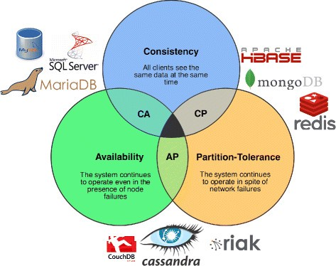

# CAP Theorem
* The CAP theorem is a tool used to makes system designers aware of the trade-offs while designing networked shared-data systems.
* The CAP theorem applies to distributed systems that store state. The theorem states that networked shared-data systems can only guarantee/strongly support two of the following three properties: Consistency, Availability and Partition Tolerance.

## Consistency
* When data is partitioned (distributed), all the nodes see the same data at a given time, and this should be true for all times
* When queried, each node will return the latest data. If not, the system will just error out.
* Consistency is achieved by updating several nodes before allowing further reads.

## Availability
* At all times, every request being fired at the system generates a valid response.
* While doing this, it doesn't mean that every request will receive a response with the latest information (data). Availability is achieved by replicating the data across different servers.

## Partition Tolerance
* The system is able to perform continuously even if a network failure or data loss occur.
* Partition tolerance can be achieved by replicating data and system functionality sufficiently across a cluster of nodes and network. The redundancy introduced ensures the system as a whole continues to function even in situations where a node or a set of nodes cannot communicate with each other.

## System classification based on CAP theorem
1. **CA (Consistent and Available):** Data is consistent between all nodes, and you can read/write from any node. Here, you cannot afford to let your network go down. For example: RDBMS like Microsoft SQL Server, Oracle and columnar relational stores.
2. **CP (Consistent and Partition Tolerant):** Data is consistent and maintains tolerance for partitioning and preventing data going out of sync. For example: Google Big Table, MongoDB (document oriented), and HBase (columnar).
3. **AP (Available and Partition Tolerant):** Nodes are always available, but they may not get you the latest data. However, they sync whenever the lines are up. For example: CouchDB (document oriented), and Cassandra (columnar).

    

## CAP theorem in action
* In real life distributed systems, *Partition Tolerance* is a must. We need to ensure that when network partition do happen, the system as a whole is still functional.
* Consequently, system designers must choose between *Consistency* and *Availability*. 
* Picking *Consistency* means not being able to answer a client's query as the system cannot guarantee to return the most recent write. This sacrifices *Availability*. Network partition forces non-failing nodes to reject clients' requests as these nodes cannot guarantee consistent data. 
* At the opposite end of the spectrum, being *Available* means being able to respond to a client's request but the system cannot guarantee *Consistency*, i.e., the most recent value written. Available systems provide the best possible answer under the given circumstance.
* During normal operation (lack of network partition) the CAP theorem does not impose constraints on availability or consistency.
* The C and A in ACID represent different concepts than C and A in the CAP theorem.

## How to use CAP theorem during system design interview?
* During a system design interview, you should always clarify what type of guarantee the interviewer is looking for in the system under discussion. 
* For example, if you're building a news feed like Twitter, it might have the requirement that system should be Highly Available. Here, *Consistency* can take a hit in favor of *Availability*, if a news feed does not show up for a little while, it should be fine.
* With the above requirement, you immediately know that you need an AP system, that is, a system which offers availability during a network partition. So you can choose a NoSQL solution like Cassandra or Dynamo DB.

## Sources
* https://www.acodersjourney.com/system-design-interview-cap-theorem/
* https://dzone.com/articles/understanding-the-cap-theorem
* https://www.youtube.com/watch?v=l9JSK9OBzA4&list=PLkQkbY7JNJuAhePp7E_WSpfFqjQp6RniV&index=2
