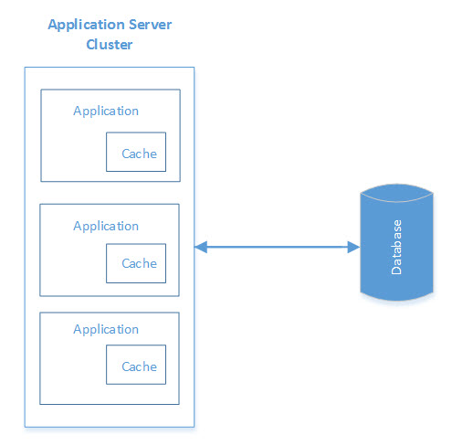
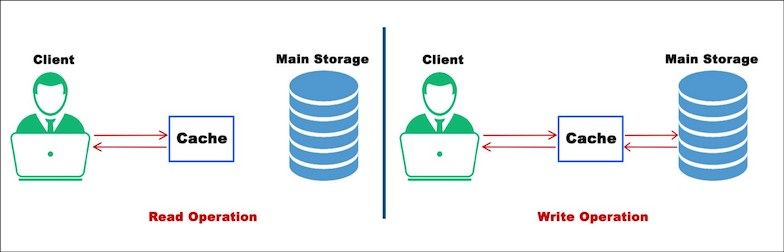
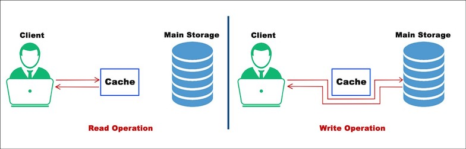
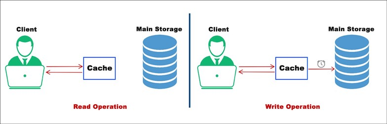

# Caching
* A cache is a memory buffer used to temporarily store frequently accessed data. It improves performance since data does not have to be retrieved again from the original source. 
* In a distributed application, the client/server side cache plays a significant role in improving application performance. 
* The ***Client-side Cache*** is used to temporarily store the static data transmitted over the network from the server to avoid unnecessarily calling to the server. 
* On the other hand, the ***Server-side Cache*** is used to store data in memory fetched from other resources.

## In-Process Caching
* ***In-process caching*** enables objects to be stored in the same instance as the application, i.e. the cache is locally available to the application and shares the same memory space.
* If the application is deployed only in one node, i.e. has a single instance, then in-process caching is the right candidate to store frequently accessed data with fast data access.
* If the In-process cache will be deployed in multiple instances of the application, then keeping data in sync across all instances could be a challenge and cause data inconsistency.
* If server configurations are limited, then this type of cache can degrade the performance of any application since it shares the same memory and CPU. A garbage collector will be invoked often to clean up objects that may lead to performance overhead. 
* If data eviction isn't managed effectively, then out-of-memory errors can occur.

## Distributed Caching
* Distributed caches (key/value objects) can be built externally to an application that supports read/write to/from data repositories, keeps frequently accessed data in RAM, and avoid continuous fetching data from the data source. 
* Such caches can be deployed on a cluster of multiple nodes, forming a single logical view. 
* Caching clients use hashing algorithms to determine the location of an object in a cluster node.
* An In-memory distributed cache is the best approach for mid to large-sized applications with multiple instances on a cluster where performance is key. 
* Data inconsistency and shared memory aren't matters of concern, as a distributed cache is deployed in the cluster as a single logical state.
* As inter-process is required to access caches over a network, latency, failure, and object serialization are some overheads that could degrade performance.
* The implementation is more difficult than in-process caching.

### How Distributed Cache Works
* Distributed cache under the covers is a Distributed Hash Table which has a responsibility of mapping Object Values to Keys spread across multiple nodes.
* A hash table manages the addition, deletion, failure of nodes continually as long as the cache service is online. 

### Why we need Distributed Caching?
Distributed Cache System is primarily used in the industries today, for having the potential to scale on demand & being highly available.
1. Scalability, High Availability, Fault-tolerance are crucial to the large scale services running online today.
2. Businesses cannot afford to have their services go offline. Distributed Cache System is distributed across multiple nodes with a pretty solid amount of redundancy.

### How a distributed cache is different from Traditional Caching ?
* Distributed cache is designed to scale inherently. They are designed in a way such that their power can be augmented on the fly be it compute, storage or anything.
* But a traditional cache is hosted on a few instances & has a limit to it. It’s hard to scale it on the fly. It’s not so available & fault-tolerant in comparison to the Distributed cache design.

## Use case of Distributed Cache
1. __Database Caching:__ The Cache can be placed between Application Server and Database. We access the data from cache instead of main datastore. The Cache accesses data in-memory to cut down latency & unnecessary load on it. There is no DB bottleneck when the cache is implemented.
2. __User Sessions Storing:__ User sessions are mostly stored in the cache to avoid losing the user information in case any of the instances go down.
If any of the instance goes down, a new instance spins up, reads the user data from the cache & continues the session without having the user notice anything amiss.
3. __In-memory Data Lookup:__ If you have a mobile / web app front end you might want to cache some information like user profile, some historical data, or some API response according to your use cases. Caching will help in storing such data.

## Cache Invalidation
* It does require some maintenance for keeping cache coherent with the source of truth (e.g., database). 
* If any data is modified in the database, it should be invalidated or modified in the cache also; if it is not so, this can cause inconsistent application behavior.
* A cache can be invalidated in the following ways.

### Read-Through
* The data is written into the cache and the corresponding database at the same time. 
* This scheme maintains the complete data consistency between the cache and the main storage. 
* This scheme also ensures that nothing will get lost in case of a crash, power failure, or any other system disruptions.
* The disadvantage of this scheme is the Higher Latency, since every write operation is done twice before returning success to the client.

### Write-Through
* In this strategy, every information directly written to the database just bypassing the cache.
* The disadvantage of this scheme is the Higher Latency if in case of a read request for recently written data will create a _Cache Miss_ and then the read request must be made on back-end storage.

### Write-Back
* The data is written to cache only and completion is immediately confirmed to the client. 
* The write to the permanent storage is done after specified intervals or under certain conditions. This results in low latency and high throughput for write-intensive applications.
* However, this speed comes with the risk of data loss in case of a crash or other adverse event because the only copy of the written data is in the cache.

## Cache Eviction Policy
* What if our Cache is full ? So, A cache eviction algorithm is a way of deciding which element to evict when the cache is full.
* The following are some of the most common cache eviction policies:
  1. __First In First Out (FIFO):__ The cache evicts the first block accessed first without any regard to how often or how many times it was accessed before.
  2. __Last In First Out (LIFO):__ The cache evicts the block accessed most recently first without any regard to how often or how many times it was accessed before.
  3. __Least Recently Used (LRU):__ Discards the least recently used items first. This is the most popular policy.
  4. __Most Recently Used (MRU):__ Discards, in contrast to LRU, the most recently used items first.
  5. __Least Frequently Used (LFU):__ Counts how often an item is needed. Those that are used least often are discarded first.

## Popular Distributed Caches
* The popular distributed caches used in the industry are Eh-cache, Memcache, Redis, Riak, Hazelcast.
* ***Memcache*** is most popular cache which is used by Google Cloud in its Platform As A Service.
* ***Redis*** is an open-source in-memory distributed system which supports other data structures too such as distributed lists, queues, strings, sets, sorted sets. 
* Besides caching, Redis is also often treated as a NoSQL data store.

## Sources
* https://dzone.com/articles/introducing-amp-assimilating-caching-quick-read-fo
* https://medium.com/rtkal/distributed-cache-design-348cbe334df1
* https://www.youtube.com/watch?v=U3RkDLtS7uY
